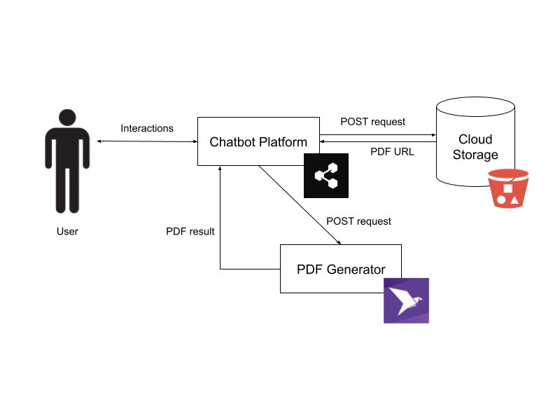
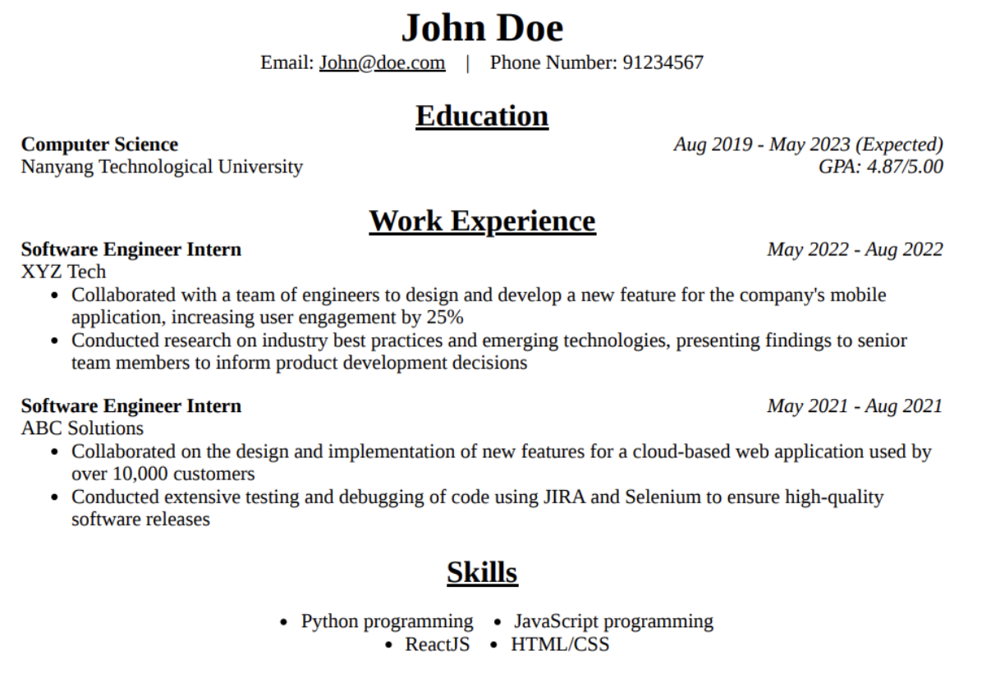

# Resumate

A Chatbot-as-a-Service project for CE/CZ4052 Cloud Computing.

The project aims to build a chatbot that assists job seekers in creating a professional resume. The chatbot interacts with the job seeker and gathers relevant information about their work experience, education, skills, and achievements. Based on this information, the chatbot can then generate a professional resume tailored to the job seeker's needs and preferences using Natural Language Processing (NLP) and Machine Learning (ML) techniques, and users can download the PDF file of the resume from the chatbot.

Make your resume [here](https://resumate-chatbot.netlify.app/)!

## Communication Diagram

---

## Sample Resume

---

## Demo

---

Watch the demo [here](https://youtu.be/awsMnjYhmZw).
